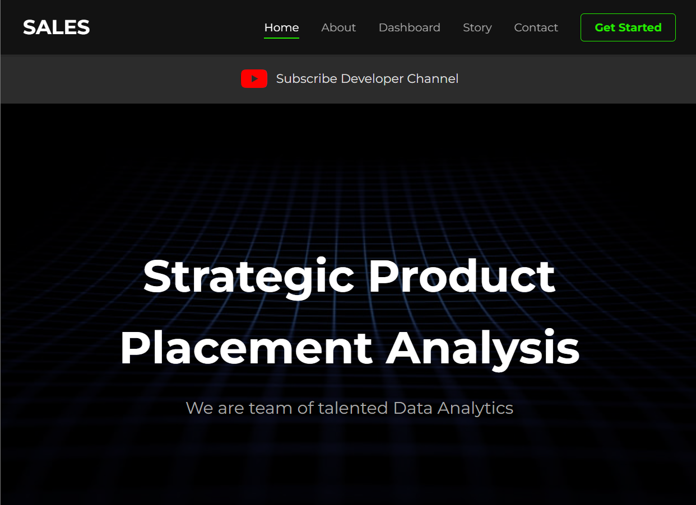

# Strategic Product Placement Analysis

Welcome to **Strategic Product Placement Analysis** – a web-based platform for analyzing and visualizing data on product placements to drive smarter business decisions.



## Live Demo

Access the live application here:  
👉 [https://surya-smartbridge.vercel.app](https://surya-smartbridge.vercel.app)

## Features

- **Home**: Landing page introducing the platform and its purpose.
- **About**: Learn more about the team and the project.
- **Dashboard**: Data analytics dashboard for product placement insights.
- **Story**: Narrative or case study related to strategic product placement.
- **Contact**: Get in touch via a contact form (submissions are printed to the server console).

## Technologies Used

- **Python** (Flask)
- **HTML/CSS/Jinja2** (templating)
- **Vercel** (deployment)

## Getting Started

### Prerequisites

- Python 3.x
- Flask

### Installation

1. **Clone the repository:**
   ```bash
   git clone https://github.com/nallamothusurya/surya-smartbridge.git
   cd surya-smartbridge
   ```

2. **Install dependencies:**
   ```bash
   pip install flask
   ```

3. **Run the app locally:**
   ```bash
   python app.py
   ```
   The app will be available at `http://127.0.0.1:5000/`.

### File Structure

```
surya-smartbridge/
│
├── app.py
├── app.png
├── templates/
│   ├── base.html
│   ├── index.html
│   ├── about.html
│   ├── dashboard.html
│   ├── story.html
│   └── contact.html
```

## Usage

Navigate between pages using the navbar.  
Submit the contact form to test message handling (prints to the backend console).

## Contributing

Feel free to fork the repo, submit issues, or open PRs!

## License

This project is provided for educational purposes.

## Author

- [nallamothusurya](https://github.com/nallamothusurya)

---

> **Live Demo**: [surya-smartbridge.vercel.app](https://surya-smartbridge.vercel.app)
